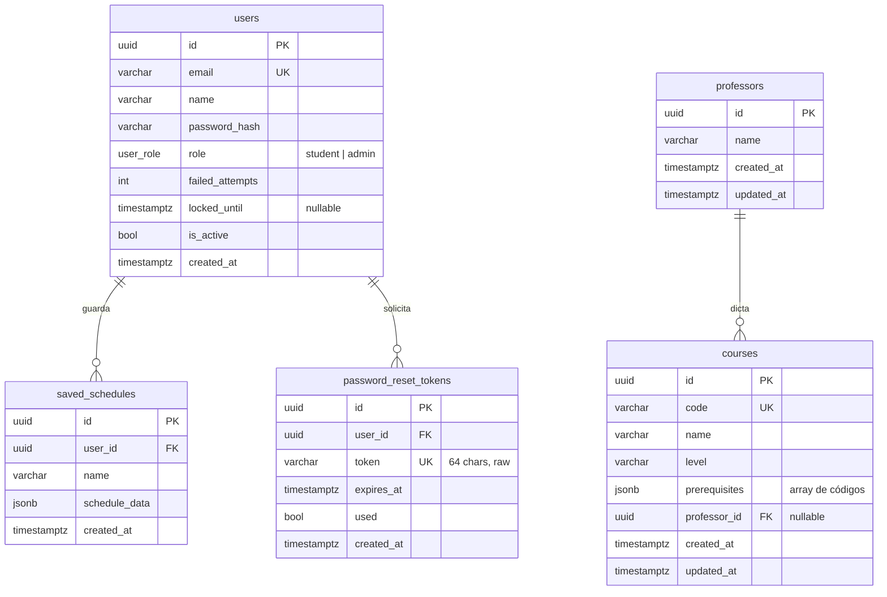

# DATA_MODEL.md — Modelo de datos de SmartSched-Ulima

> **Motor:** PostgreSQL 17 (Neon serverless, `us-east-1`). SQLAlchemy async + Alembic.
> **Estado:** secciones marcadas con ✅ están implementadas y aplicadas en Neon.
> Las marcadas con *(diseño)* están planificadas pero pendientes de migración.

---

## Convenciones

- **IDs:** tipo `UUID` nativo en PostgreSQL (`Uuid(as_uuid=False)` en SQLAlchemy → retorna strings en Python). Equivale a `CHAR(32)` en SQLite para tests.
- **Timestamps:** `TIMESTAMP WITH TIME ZONE`. `created_at` con `server_default=now()`; `updated_at` con `server_default=now()` + `onupdate=now()`.
- **Rol:** ENUM nativo `user_role` en PostgreSQL (`'student' | 'admin'`). En SQLite (tests) equivale a `VARCHAR`.
- **FK cascade:** por defecto `ON DELETE CASCADE`; excepciones explicitadas por tabla.
- **JSONB:** solo para `saved_schedules.schedule_data` (snapshot inmutable) y `courses.prerequisites` (lista de códigos de prereqs; se normalizará en una migración futura cuando sea necesario consultarlos).
- **Nombres:** tablas y columnas en `snake_case`.

---

## Diagrama ER — tablas implementadas

---

## Tablas implementadas

### `users` ✅ — US-24 *(migración 0001, tipo ajustado en 0006)*

| Columna | Tipo PG | Notas |
|---|---|---|
| id | `UUID` | PK |
| email | `VARCHAR(255)` | UNIQUE, index |
| name | `VARCHAR(120)` | |
| password_hash | `VARCHAR(255)` | bcrypt |
| role | `user_role` (ENUM) | `student` \| `admin`; default `student` |
| failed_attempts | `INTEGER` | default 0 |
| locked_until | `TIMESTAMPTZ` | null = sin bloqueo |
| is_active | `BOOLEAN` | default true |
| created_at | `TIMESTAMPTZ` | server default now() |

Regla: 3 intentos fallidos → `locked_until = now + 15 min`. Login OK resetea contador y bloqueo.

---

### `saved_schedules` ✅ — US-09 *(migración 0002)*

| Columna | Tipo PG | Notas |
|---|---|---|
| id | `UUID` | PK |
| user_id | `UUID` | FK → users (`CASCADE`), index |
| name | `VARCHAR(120)` | nombre que el usuario asigna |
| schedule_data | `JSONB` | snapshot completo de la opción (cursos + secciones seleccionadas) |
| created_at | `TIMESTAMPTZ` | server default now() |

Regla de negocio: **máx. 10 por usuario** — se valida en servicio (409 si excede).

---

### `professors` ✅ — US-32 admin *(migraciones 0003, updated_at en 0007)*

| Columna | Tipo PG | Notas |
|---|---|---|
| id | `UUID` | PK |
| name | `VARCHAR(120)` | |
| created_at | `TIMESTAMPTZ` | server default now() |
| updated_at | `TIMESTAMPTZ` | server default now(); `onupdate=now()` |

`initials` **no se persiste** — se deriva del nombre en la capa de servicio (strip de títulos Dr./Dra./Prof./Mg. + primeras letras).

---

### `courses` ✅ — US-32 admin *(migraciones 0004 + 0005, updated_at en 0007)*

| Columna | Tipo PG | Notas |
|---|---|---|
| id | `UUID` | PK |
| code | `VARCHAR(20)` | UNIQUE, index; se almacena en mayúsculas |
| name | `VARCHAR(120)` | |
| level | `VARCHAR(10)` | "1".."10" (el FE lo envía como string) |
| prerequisites | `JSONB` | array de códigos de curso, ej. `["CS101","MAT101"]` |
| professor_id | `UUID` | FK → professors (`SET NULL`), nullable, index |
| created_at | `TIMESTAMPTZ` | server default now() |
| updated_at | `TIMESTAMPTZ` | server default now(); `onupdate=now()` |

`prerequisites` usa JSONB por simplicidad en esta fase. Se normalizará a tabla `course_prerequisites` (M2M) cuando sea necesario filtrar/consultar por prereq.

---

### `password_reset_tokens` ✅ — US-25 *(migración 0009)*

| Columna | Tipo PG | Notas |
|---|---|---|
| id | `UUID` | PK |
| user_id | `UUID` | FK → users (`CASCADE`), index |
| token | `VARCHAR(64)` | UNIQUE, index; `secrets.token_urlsafe(32)` (raw, no hash) |
| expires_at | `TIMESTAMPTZ` | now + 60 min (configurable vía `RESET_TOKEN_EXPIRE_MINUTES`) |
| used | `BOOLEAN` | default false; se marca true al usar el token |
| created_at | `TIMESTAMPTZ` | server default now() |

Regla: al solicitar un nuevo reset, se eliminan todos los tokens anteriores del mismo usuario. Un token usado o expirado devuelve 400.

---

## Tablas diseñadas — pendientes de implementar

### `reviews` *(diseño — US-21 vía agente IA, diferido)*

Reseñas de usuarios a profesores. US-21 se resuelve actualmente vía agente IA (conocimiento del LLM). Esta tabla se construirá si el sistema pasa a ser data-driven.

| Columna | Tipo | Notas |
|---|---|---|
| id | UUID | PK |
| user_id | UUID | FK → users (CASCADE) |
| professor_id | UUID | FK → professors (CASCADE) |
| rating | INTEGER | CHECK 1..5 |
| comment | VARCHAR(500) | nullable |
| created_at | TIMESTAMPTZ | |

Constraint: `UNIQUE(user_id, professor_id)` — una reseña por usuario por profesor.

---

### `sections` + `section_times` *(diseño — US-32 completo, diferido)*

Secciones de un curso con sus bloques horarios normalizados. Conectarán el catálogo admin con el generador de horarios.

**`sections`**

| Columna | Tipo | Notas |
|---|---|---|
| id | UUID | PK |
| course_id | UUID | FK → courses (CASCADE) |
| professor_id | UUID | FK → professors (SET NULL), nullable |
| name | VARCHAR(10) | "A", "01", "853" |
| created_at | TIMESTAMPTZ | |

Constraint: `UNIQUE(course_id, name)`.

**`section_times`**

| Columna | Tipo | Notas |
|---|---|---|
| id | UUID | PK |
| section_id | UUID | FK → sections (CASCADE) |
| dia | VARCHAR(3) | LUN/MAR/MIE/JUE/VIE/SAB/DOM |
| inicio | VARCHAR(5) | "HH:MM" |
| fin | VARCHAR(5) | "HH:MM" |
| aula | VARCHAR(20) | nullable |

Alimentará el generador (US-07) reemplazando el shape manual que hoy envía el frontend.

---

### `conversations` + `messages` *(diseño — US-13/14, diferido)*

Persistencia del chat del agente IA. Hoy las conversaciones son **in-memory** (`chat/store.py`).

**`conversations`**

| Columna | Tipo | Notas |
|---|---|---|
| id | UUID | PK |
| user_id | UUID | FK → users (CASCADE) |
| title | VARCHAR(200) | |
| created_at | TIMESTAMPTZ | |
| updated_at | TIMESTAMPTZ | |

**`messages`**

| Columna | Tipo | Notas |
|---|---|---|
| id | UUID | PK |
| conversation_id | UUID | FK → conversations (CASCADE) |
| role | VARCHAR(10) | `user` \| `assistant` |
| content | TEXT | |
| created_at | TIMESTAMPTZ | |

---

## Historial de migraciones

| # | Archivo | Qué hace | Estado |
|---|---|---|---|
| 0001 | `create_users_table` | Tabla `users` | ✅ Neon |
| 0002 | `create_saved_schedules` | Tabla `saved_schedules` | ✅ Neon |
| 0003 | `create_professors_table` | Tabla `professors` | ✅ Neon |
| 0004 | `create_courses_table` | Tabla `courses` (sin professor_id) | ✅ Neon |
| 0005 | `add_professor_id_to_courses` | Columna `courses.professor_id` + FK | ✅ Neon |
| 0006 | `native_uuid_and_role_enum` | IDs a UUID nativo; `role` a ENUM `user_role` | ✅ Neon |
| 0007 | `add_updated_at` | Columna `updated_at` en professors y courses | ✅ Neon |
| 0008 | `add_updated_at_defaults` | `DEFAULT now()` para updated_at (fix post-migración) | ✅ Neon |
| 0009 | `create_password_reset_tokens` | Tabla `password_reset_tokens` | ✅ Neon |

---

## Decisiones de diseño

1. **UUID nativo** en PostgreSQL (migración 0006) — consistencia real de tipo, mejor rendimiento en índices y JOINs. En SQLite (tests) SQLAlchemy usa `CHAR(32)`; los tests usan UUIDs válidos.
2. **ENUM `user_role`** — garantía a nivel DB, no solo aplicación.
3. **`prerequisites` en JSONB** (fase actual) — simplicidad mientras no se necesita filtrar por prereq. Se normalizará a M2M cuando el generador consuma el catálogo admin.
4. **`updated_at` en professors y courses** — útil para el frontend (ordenar por última modificación, detectar cambios).
5. **Token de reset raw** (no hash) — `secrets.token_urlsafe(32)` es suficientemente seguro para tokens de un solo uso con expiración de 60 min. Si se requiere mayor seguridad, se puede migrar a SHA-256.
6. **Profesor ≠ usuario** — `professors` no tiene login. Es una entidad del catálogo académico.
7. **`saved_schedules.schedule_data` en JSONB** — snapshot inmutable; no se consulta por campo.
8. **Neon fuera de GCP** — excepción aceptada para la BD (free tier, escala a cero). Todo el compute sigue en `ulima-agent`.
