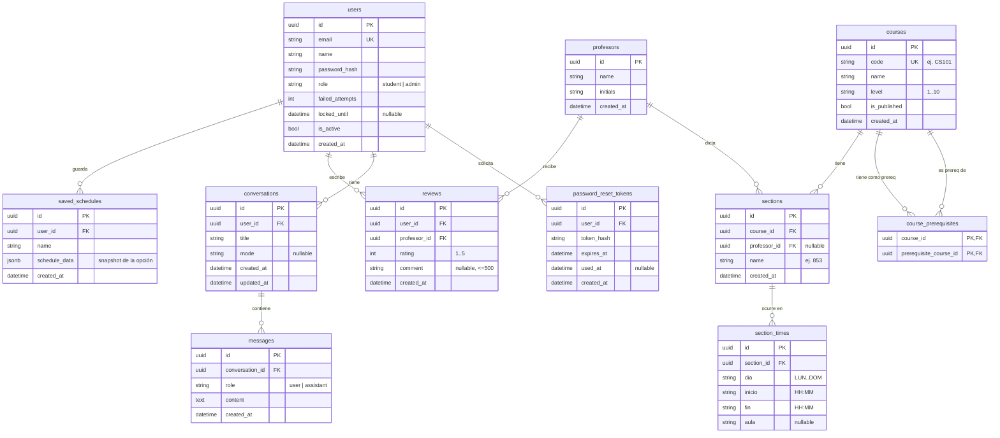

# DATA_MODEL.md — Modelo de datos de SmartSched-Ulima

> **Fuente:** historias de usuario (`CLAUDE.md`) + contrato FE↔BE (`CONTRACTS.md`).
> **Estado:** solo `users` está implementada (migración Alembic `0001`). El resto es **diseño**;
> cada tabla se materializa en su propia migración cuando se construya la US correspondiente.
>
> Motor: **PostgreSQL** (local: Docker `docker compose up -d`; prod: Cloud SQL). SQLAlchemy async + Alembic.

---

## Convenciones

- **IDs:** `VARCHAR(36)` con **UUID** (string), porque el frontend espera ids string en todas las entidades.
- **Timestamps:** `TIMESTAMP WITH TIME ZONE`, `created_at` con `server_default=now()`.
- **Rol:** una sola codificación canónica en BD → `role ∈ {"student","admin"}`. El `"Estudiante"/"Admin"`
  del panel admin (FE) se mapea en la capa de presentación (ver mismatch #2 de `CONTRACTS.md`).
- **Borrados:** FKs hacia `users`/`courses`/etc. con `ON DELETE CASCADE` salvo `sections.professor_id`
  (`SET NULL`: si se borra un profesor, la sección no desaparece).
- **JSONB** se usa **solo** para el snapshot de un horario guardado (es un documento, no datos a consultar por campo).
  Todo lo demás está normalizado.
- **Nombres:** tablas y columnas en `snake_case`.

---

## Diagrama ER

---

## Tablas

### `users` — US-24 ✅ *(implementada, migración 0001)*
Cuentas autenticables (estudiantes y admins).

| Columna | Tipo | Notas |
|---|---|---|
| id | varchar(36) | PK (UUID) |
| email | varchar(255) | **UNIQUE**, index |
| name | varchar(120) | |
| password_hash | varchar(255) | bcrypt |
| role | varchar(20) | `student` \| `admin` (default `student`) |
| failed_attempts | int | default 0 |
| locked_until | timestamptz | null = no bloqueado |
| is_active | bool | default true |
| created_at | timestamptz | default now() |

Reglas: 3 intentos fallidos → `locked_until = now + 15 min`; login OK resetea contador.

### `saved_schedules` — US-09
Horarios que el estudiante guarda desde "Horarios Generados".

| Columna | Tipo | Notas |
|---|---|---|
| id | varchar(36) | PK |
| user_id | varchar(36) | FK → users (CASCADE), index |
| name | varchar(120) | nombre que pone el usuario |
| schedule_data | jsonb | snapshot de la opción elegida (cursos + secciones) |
| created_at | timestamptz | |

Regla de negocio: **máx. 10 por usuario** (se valida en el servicio, `409` si excede).

### `professors` — US-21
Profesores (entidad única; la vista estudiante y la vista admin son dos proyecciones de esto).

| Columna | Tipo | Notas |
|---|---|---|
| id | varchar(36) | PK |
| name | varchar(120) | |
| initials | varchar(8) | derivadas del name (quitando Dr./Dra./Prof./Mg./Ing./Lic.) |
| created_at | timestamptz | |

`rating` promedio y `reviewCount` **no se persisten**: se calculan por agregación sobre `reviews`.
No se vincula a `users` (un profesor no inicia sesión).

### `reviews` — US-21
Reseña de un usuario a un profesor.

| Columna | Tipo | Notas |
|---|---|---|
| id | varchar(36) | PK |
| user_id | varchar(36) | FK → users (CASCADE), index |
| professor_id | varchar(36) | FK → professors (CASCADE), index |
| rating | int | CHECK 1..5 |
| comment | varchar(500) | nullable |
| created_at | timestamptz | |

Constraint: **UNIQUE(user_id, professor_id)** → una reseña por usuario por profesor (`409` si duplica).

### `courses` — US-32
Cursos administrables y publicables.

| Columna | Tipo | Notas |
|---|---|---|
| id | varchar(36) | PK |
| code | varchar(12) | **UNIQUE** (regex `^[A-Z]{2,4}\d{2,4}$`, ej. `CS101`) |
| name | varchar(120) | |
| level | varchar(2) | "1".."10" (el FE lo manda como string) |
| is_published | bool | default false (solo los publicados los ven los estudiantes) |
| created_at | timestamptz | |

### `sections` — US-32
Secciones de un curso.

| Columna | Tipo | Notas |
|---|---|---|
| id | varchar(36) | PK |
| course_id | varchar(36) | FK → courses (CASCADE), index |
| professor_id | varchar(36) | FK → professors (**SET NULL**), nullable |
| name | varchar(10) | "A", "01", "853" |
| created_at | timestamptz | |

Constraint: **UNIQUE(course_id, name)**.

### `section_times` — US-32
Bloques horarios de cada sección (normalizado: una fila por bloque).

| Columna | Tipo | Notas |
|---|---|---|
| id | varchar(36) | PK |
| section_id | varchar(36) | FK → sections (CASCADE), index |
| dia | varchar(3) | LUN/MAR/MIE/JUE/VIE/SAB/DOM |
| inicio | varchar(5) | "HH:MM" |
| fin | varchar(5) | "HH:MM" |
| aula | varchar(20) | nullable |

Alimenta el generador (US-07) y se reconstruye al shape `horario[]` que consume el FE.

### `course_prerequisites` — US-32
Prerrequisitos entre cursos (M2M auto-referencial).

| Columna | Tipo | Notas |
|---|---|---|
| course_id | varchar(36) | PK, FK → courses (CASCADE) |
| prerequisite_course_id | varchar(36) | PK, FK → courses (CASCADE) |

PK compuesta `(course_id, prerequisite_course_id)`; CHECK `course_id <> prerequisite_course_id`.
El FE manda los prereqs como CSV (`"CS101, MAT101"`) → se parsean a filas.

### `conversations` — US-12
Conversaciones del chat con el agente IA (hoy **in-memory**; esta tabla las persiste).

| Columna | Tipo | Notas |
|---|---|---|
| id | varchar(36) | PK |
| user_id | varchar(36) | FK → users (CASCADE), index |
| title | varchar(200) | |
| mode | varchar(30) | nullable: `professorReputation`\|`courseDifficulty`\|`coursePrerequisites` |
| created_at | timestamptz | |
| updated_at | timestamptz | |

### `messages` — US-12
Mensajes de una conversación.

| Columna | Tipo | Notas |
|---|---|---|
| id | varchar(36) | PK |
| conversation_id | varchar(36) | FK → conversations (CASCADE), index |
| role | varchar(10) | `user` \| `assistant` |
| content | text | |
| created_at | timestamptz | |

### `password_reset_tokens` — US-25 *(diferido)*
Tokens temporales para restablecer contraseña (flujo con enlace por correo).

| Columna | Tipo | Notas |
|---|---|---|
| id | varchar(36) | PK |
| user_id | varchar(36) | FK → users (CASCADE), index |
| token_hash | varchar(255) | se guarda el **hash** del token, no el token plano |
| expires_at | timestamptz | ej. now + 1 h |
| used_at | timestamptz | nullable (null = no usado) |
| created_at | timestamptz | |

---

## Decisiones de diseño

1. **Horarios de sección normalizados** (`section_times`) en vez de JSONB → más correcto relacionalmente y mejor para la sustentación.
2. **Prerrequisitos como M2M auto-referencial** (`course_prerequisites`) en vez de CSV.
3. **`saved_schedules.schedule_data` en JSONB** → es un snapshot/documento, no datos a consultar por campo.
4. **Profesor ≠ usuario**: `professors` es entidad propia, sin login.
5. **`rating`/`reviewCount` calculados** por agregación, no persistidos (evita desincronización).
6. **Rol canónico `student`/`admin`** en BD; el español capitalizado del FE admin se mapea fuera.
7. **IDs UUID string** en todas las tablas (consistencia con el FE).

---

## Estado y orden de migraciones

| # | Migración | Tablas | Estado |
|---|---|---|---|
| 0001 | `create_users_table` | `users` | ✅ hecha |
| 0002 | `create_saved_schedules` | `saved_schedules` | ✅ escrita (US-09; falta aplicarla a la BD) |
| 0003 | *(sugerida)* | `professors`, `reviews` | pendiente (US-21) |
| 0004 | *(sugerida)* | `courses`, `sections`, `section_times`, `course_prerequisites` | pendiente (US-32) |
| 0005 | *(sugerida)* | `conversations`, `messages` | pendiente (US-12, persistir chat) |
| 0006 | *(sugerida)* | `password_reset_tokens` | pendiente (US-25, diferido) |

> Al crear cada modelo, importarlo en `app/db/migrations/env.py` para que Alembic lo detecte,
> y generar la migración con `uv run alembic revision --autogenerate -m "..."`.
